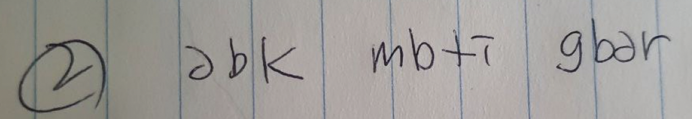
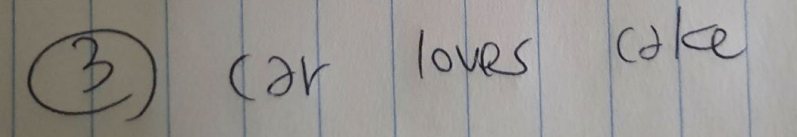

# exercise 2.1 to 2.4

## exercise 2.1

- 생소한 기호 조합이라서 거의 기억하지 못함

## exercise 2.2

- 짧아서 그런지 생각보다 많이 기억했는데 중간 단어는 머리속에서 익숙한 단어로 치환되어 기억됨

## exercise 2.3

- 한번 보고 쉽게 기억할 수 있었음

## exercise 2.4

> https://gist.github.com/MichalStrehovsky/6e2549f0630f4d36a03bd3ea61c618e0#file-framebuffer-cs

(적당한 길이의 코드를 찾다가 인터넷에서 줏은 [스네이크 코드](https://medium.com/@MStrehovsky/building-a-self-contained-game-in-c-under-8-kilobytes-74c3cf60ea04)의 일부 입니다)

코드의 구조는 어떻게 되어 있는가?
- 중첩된 코드인가? 
  - for loop 와 if 조합으로 조금 중첩된 코드
- 눈에 띄는 라인?
  - for loop 내의 조건별로 분기하는 if문. 조건이 좀 많아서 눈에 띔.

코드에서 들여쓰기는 어떻게 되어 있는가?
- 코드 간격? 
  - 적절하게 띄워져 있었던 것 같음.
- 큰 뭉치처럼 보이는 것?
  - 선언부, 각 메소드 별 한 덩어리로 보임. for loop가 한 덩어리로 보임